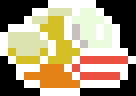

# Flappy Bird

A Flappy Bird clone built in C++ with [raylib](https://www.raylib.com/) - now
with a global online leaderboard. Tap to fly, dodge the pipes, and chase the
top spot.

## Download

Grab the build for your OS from the
[**Releases**](https://github.com/meta-legend/Flappy_Bird/releases) page, unzip
it, and run Flappy_Bird no installation needed (Supports Windows, Linux, macOS).

## How To Play:

1. On the title screen, type your name and press Enter to start.
2. Flap with Space, W, Up arrow, or left mouse button.
3. Avoid the pipes, and the game speeds up the longer you survive.
4. After you crash, press Space to try again.

Your best score is saved locally, and each run is submitted to the online
leaderboard automatically.

## Credits

Theme music by [HeatleyBros](https://www.youtube.com/channel/UCsLlqLIE-TqDq3lh5kU2PeA).

---

Want to build from source or contribute? See [CONTRIBUTING.md](CONTRIBUTING.md).
